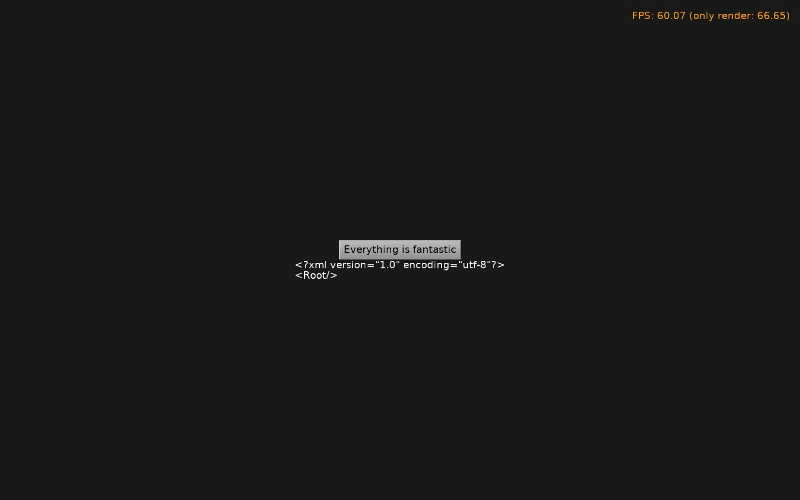
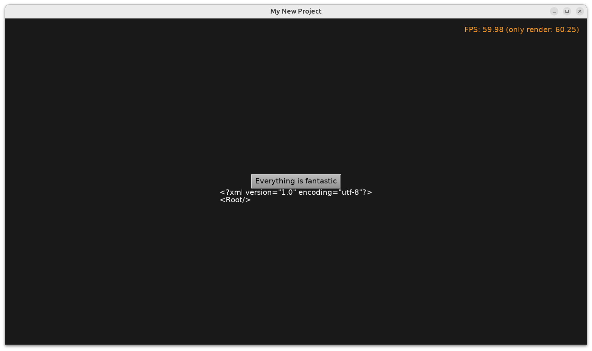

# Test Saving Config File in Subdirectory

Reproduction for an issue https://discord.com/channels/389676745957310465/1261345174206943272 : on Android, writing to `ApplicationConfig('presets/xxxx.xml')` was failing, because we didn't do `ForceDirectories` to create the `presets` subdirectory.

Fixed in CGE in https://github.com/castle-engine/castle-engine/commit/c281e332c544bd109e475440f1ece4dfe64a6b3e .

Using [Castle Game Engine](https://castle-engine.io/).

## Screenshots

## Building

Compile by:

- [CGE editor](https://castle-engine.io/editor). Just use menu items _"Compile"_ or _"Compile And Run"_.

- Or use [CGE command-line build tool](https://castle-engine.io/build_tool). Run `castle-engine compile` in this directory.

- Or use [Lazarus](https://www.lazarus-ide.org/). Open in Lazarus `test_config_subdir_standalone.lpi` file and compile / run from Lazarus. Make sure to first register [CGE Lazarus packages](https://castle-engine.io/lazarus).

- Or use [Delphi](https://www.embarcadero.com/products/Delphi). Open in Delphi `test_config_subdir_standalone.dproj` file and compile / run from Delphi. See [CGE and Delphi](https://castle-engine.io/delphi) documentation for details.